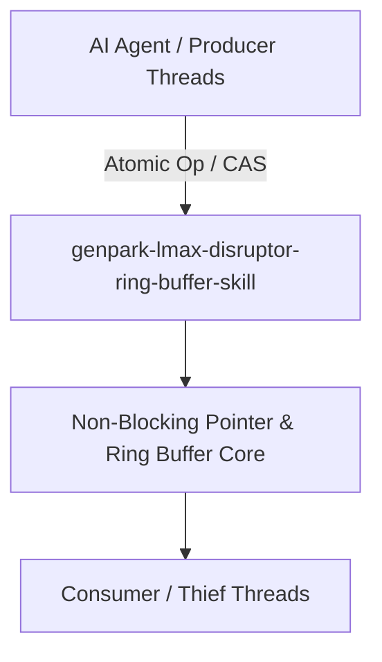

# genpark-lmax-disruptor-ring-buffer-skill

[](https://github.com/alphaparkinc/genpark-lmax-disruptor-ring-buffer-skill/actions)
[](https://opensource.org/licenses/MIT)
[](https://www.python.org/downloads/)

> LMAX Disruptor high-throughput circular ring buffer architecture with sequence barriers, cursor publisher, and zero-allocation event batching.

## Architecture



## Features
- Pure standard library Python implementation with strictly zero pip dependencies.
- True non-blocking algorithms preventing priority inversion, deadlocks, and lock contention.
- Native Model Context Protocol (MCP) server support for high-throughput AI agent pipelines.

## Installation

```bash
git clone https://github.com/alphaparkinc/genpark-lmax-disruptor-ring-buffer-skill.git
cd genpark-lmax-disruptor-ring-buffer-skill
```

## Quickstart

```bash
python example_usage.py
```
